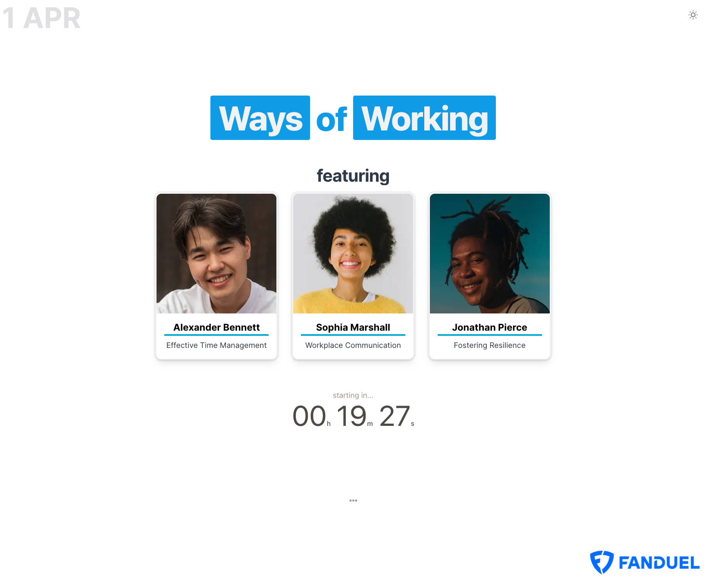
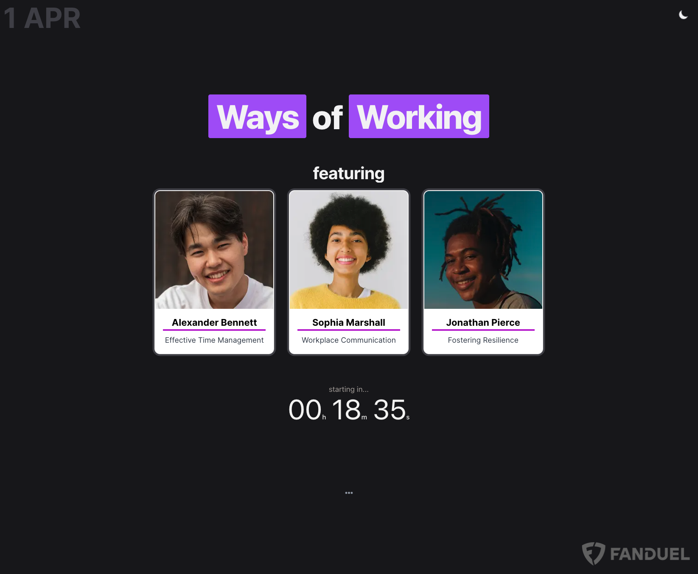

# next-simple-presentation

A simple web app for quickly creating a decent-looking backdrop before a presentation.

It's designed to be run `locally` and used when `sharing screen` during a video call.

You can easily configure the presenter's `photos`, `name`, and presentation `topic`. The app also features a `countdown timer` to let your audience know how much longer until the start time. Additionally, features both `light` and `dark mode` options.




## Getting Started

```bash
# Install dependencies
npm install

# Run app
npm run dev
```

Visit [http://localhost:3000](http://localhost:3000) in your browser to view the app.
